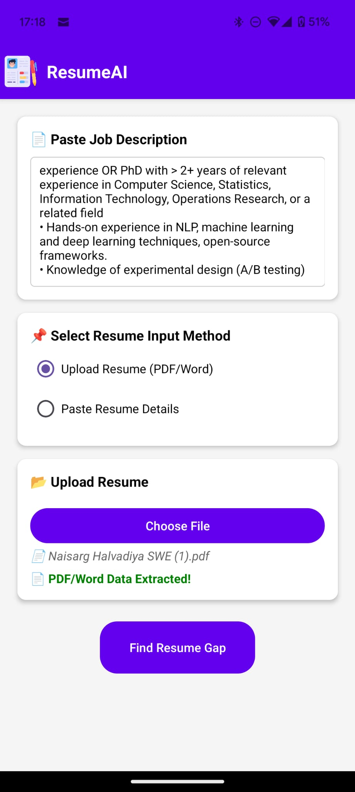
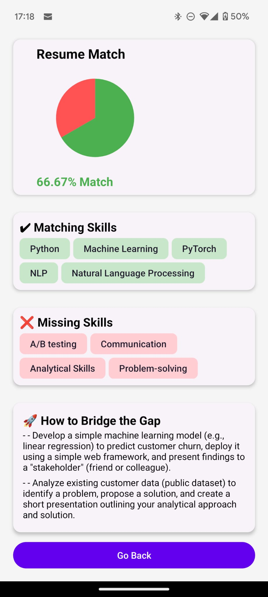

# ResumeAI - Smart Resume Gap Analysis

ResumeAI is a **React Native** application that helps job seekers analyze their resumes, compare them against job descriptions, and identify missing skills using AI-powered insights.

---

## Features
- Upload or paste resume text
- Compare resumes against job descriptions
- Identify missing skills and receive improvement suggestions

---

## Tech Stack
- **Frontend:** React Native (Expo)
- **State Management:** Redux Toolkit
- **File Uploads:** Expo Document Picker
- **Backend:** Flask with Gemini API

---

## Folder Structure
```
Smart-Resume/
│-- assets/                 # Static assets (icons, images)
│-- src/
│   ├── store/              # Redux store & slices
│   ├── screens/            # App screens (Home, Results)
│   ├── components/         # Reusable UI components
│   ├── config.js           # Configuration file for API endpoints
│-- App.js                  # Main entry file
│-- package.json            # Dependencies
```

---

## Installation & Setup

### Install Dependencies
Ensure you have **Node.js** and **Expo CLI** installed:
```sh
npm install -g expo-cli
```

Clone the repository and install dependencies:
```sh
git clone <your-repo-url>
cd Resume-Gap-Analysis
npm install
```

### Configuration
Before running the app, update the `config.js` file with the correct API base URL:
```javascript
const CONFIG = {
    API_BASE_URL: "http://10.0.0.230:5000", // Replace with production URL when deployed
    TIMEOUT: 5000, // Default timeout for API requests (in ms)
};

export default CONFIG;
```

### Run the App
Since the frontend connects to a Flask backend, **Expo should be run in tunnel mode**:
```sh
npx expo start --tunnel
```
- This allows the app to communicate with the backend over the network.
- Use the Expo Go app to scan the QR code and test the app on your device.

---

## Roadmap
- Resume text extraction
- AI-Based Resume Gap Analysis
- Personalized Skill Improvement Suggestions

---

## Screenshots





## License
MIT License. See `LICENSE` for details.

---

## Contact
For questions or collaborations, open an issue on GitHub.

